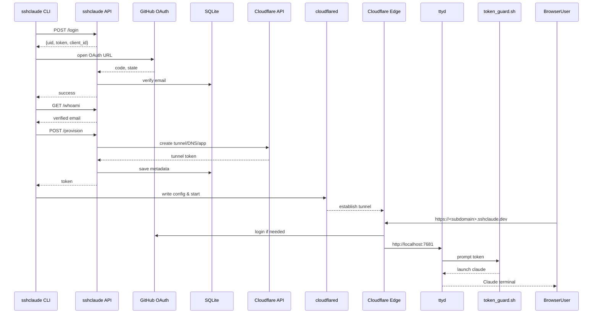

# **SSHCLAUDE** – Secure Claude Terminal in Your Browser

> **Mission** Deliver a zero-trust, browser-accessible Claude CLI with no open ports, no full shell exposure, and bi-directional interaction secured by Cloudflare Tunnel and Access.

---

## 1. What the Project Is About

SSHCLAUDE lets you interact with Claude from any browser without ever exposing a local shell or public ports. It spins up a local Claude CLI wrapped in `ttyd`, then connects that single command to the internet through a short-lived Cloudflare Tunnel gated by Cloudflare Access.

---

## 2. Features

| Capability                  | Details |
| --------------------------- | ------- |
| **Zero-port networking**    | Uses Cloudflare Tunnel to route HTTPS traffic to localhost without exposing public ports. |
| **Browser-based Claude**    | Launches Claude CLI via `ttyd` in a web terminal; not a full shell or SSH session. |
| **Access control**          | Only approved GitHub logins or IPs can access using Cloudflare Access + MFA. |
| **No SSH exposure**         | Runs Claude directly via a CLI wrapper; does not expose bash or shell access. |
| **Launch-once tunnel**      | Uses dashboard-created token to launch tunnel with `cloudflared --token`. |
| **Cloudflare Access gated** | MFA, session TTL, GitHub login or IP-based rules apply before tunnel is reached. |

---

## 3. Architecture

From a user's point of view, everything flows through Cloudflare before touching your local machine:

```text
Browser (User)
   │
   ▼ HTTPS
Cloudflare Access (SSO + MFA + IP check)
   │
   ▼ TLS + mTLS
Cloudflare Tunnel (cloudflared with token)
   │
   ▼
Local Claude CLI (wrapped in ttyd, single command only)
```

<details>
<summary>Full sequence diagram</summary>



</details>

---

## 4. How to Get Started

1. `pip install sshclaude`
2. Run `sshclaude init --github <your-login>` and follow the browser login to verify your GitHub account. You can pass extra options like `--domain <sub>` to choose a custom hostname, `--session 30m` to tweak the Cloudflare Access TTL or `--token <secret>` to supply your own unlock token.
3. Visit the printed URL (e.g. `https://<user>.sshclaude.com`) to access Claude securely in your browser.
4. Optional commands:
   * `sshclaude status` – check the tunnel and Access app health
   * `sshclaude refresh-token` – rotate the Cloudflare tunnel token
   * `sshclaude stop` – stop the running tunnel and ttyd session without deleting anything 
  * `sshclaude uninstall` – remove all Cloudflare resources and local files (requires your tunnel token)

When `sshclaude init` runs it will:

1. Install `cloudflared` and `ttyd` if missing
2. Verify your GitHub identity via the provisioning API
3. Create or reuse the Cloudflare tunnel and Access policy
4. Write a launcher script and LaunchAgent plist
5. Start the tunnel and print the public URL

### Configuration files
The init command stores everything under `~/.sshclaude` and `~/.cloudflared`:

| File | Purpose |
| ---- | ------- |
| `~/.sshclaude/config.yaml` | Saved tunnel and Access metadata |
| `~/.sshclaude/session_token` | Token required by the browser to run Claude |
| `~/.sshclaude/token_guard.sh` | Script that checks the token before launching Claude |
| `~/.sshclaude/launch_claude.sh` | Wrapper script that starts `ttyd` with the guard |
| `~/.cloudflared/token.json` | Cloudflare tunnel token used by `cloudflared` |
| `~/.cloudflared/config.yml` | Ingress rules pointing to the local `ttyd` |
| `~/Library/LaunchAgents/com.sshclaude.tunnel.plist` | macOS agent that runs `cloudflared` |

---

## 5. Protections in the Backend

The `sshclaude.com` provisioning service performs several safety checks before issuing a tunnel token:

| Task                        | Description |
| --------------------------- | ----------- |
| **Tunnel provisioning**     | Use Cloudflare API to create a new tunnel (named or token-based). |
| **DNS routing**             | Create CNAME: `<user>.sshclaude.dev` → `tunnel-id.cfargotunnel.com`. |
| **Access app creation**     | Define a Cloudflare Access application for each tunnel. |
| **Policy enforcement**      | Include only allowed GitHub logins or IPs and enforce MFA. |
| **Token issuance**          | Return connector `*.json` token to the CLI for `cloudflared --token` usage. |
| **Audit tracking**          | Log login attempts, success, session durations, and activity metadata. |
| **Token revocation API**    | Invalidate credentials and remove public hostnames if revoked or uninstalled. |
| **Expiration enforcement**  | Optionally expire tunnels on a TTL (for example, 24 hours unless refreshed). |
| **Multi-tenant separation** | Isolate per-user tunnels, Access apps, and DNS mappings. |

---

## 6. Why Is This Secure?

| Area         | Secured How |
| ------------ | ----------- |
| Shell access | ❌ Not exposed; Claude CLI only. |
| Tunnel auth  | 🔐 Token-based; no need for cert.pem or SSH keys. |
| Session TTL  | ⏱️ Short-lived sessions (e.g., 15 min) enforced by Access. |
| User control | ✅ User runs `ttyd` and Claude locally; nothing runs as root. |
| Local token guard | 🔒 The unlock token lives only on your machine and must be typed in the browser. |

The provisioning API only issues Cloudflare tokens. It cannot start `ttyd` or read your local token file, so the service itself cannot hijack or view your session. You may stop the LaunchAgent at any time using `sshclaude stop`.

---

## Status

* Claude running locally via ttyd
* Tunnel live via `cloudflared --token`
* Access gated and no shell exposure

You're ready to give this to users or build out the CLI to automate it.
